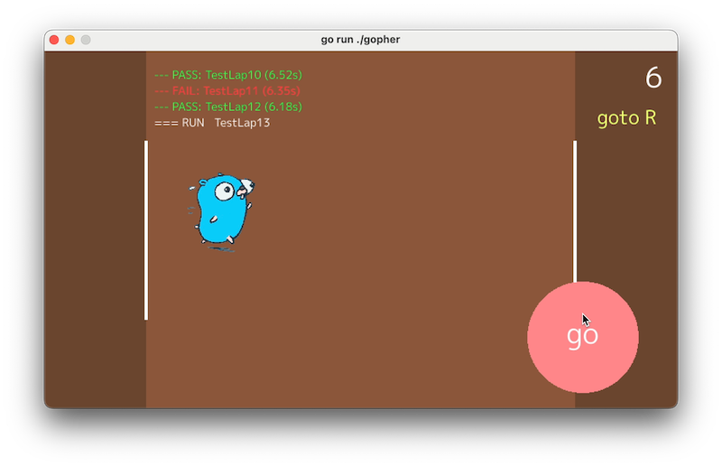

# go run ./gopher

<p align="center">[ <a href="README.md">English</a> | <b>日本語</b> ]</p>

Go言語のマスコット「Gopher」がシャトルランをする2Dゲームです。

ボタンは `go`、壁にぶつかれば `panic`、立ち直れば `recover`。成績は `go test -v` 風に流れ、最後に Go Proverb が表示されます。



## 遊び方

- `go` ボタンをタップして Gopher を加速させる
- 制限時間内にゴールラインに到達するとラップ成功
- 7ラップごとにステージが上がり、速度と難易度が上昇
- 2回連続ミスでゲーム終了

操作はタッチ優先（モバイルファースト）です。タッチがない場合はマウス入力になります。

## ビルド・実行

```bash
make run          # ゲーム実行（ネイティブ）
make wasm-dist    # WebAssembly配布パッケージ作成
make serve        # ローカルサーバ起動（localhost:8080）
make test         # テスト実行
```

### 前提条件

- Go 1.25+
- [Ebitengine](https://ebitengine.org/) の動作要件

## ドキュメント

- [ゲームデザイン仕様](docs/game-design.md) — 画面・操作・ゲームルール・バランス
- [アーキテクチャ](docs/architecture.md) — 状態マシン・パッケージ構成・設計パターン

## ライセンス

[MIT](LICENSE)
