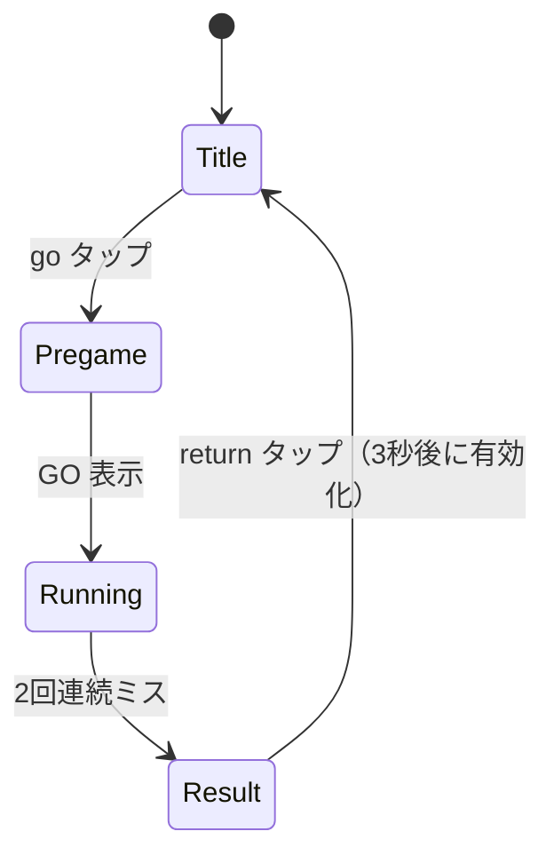
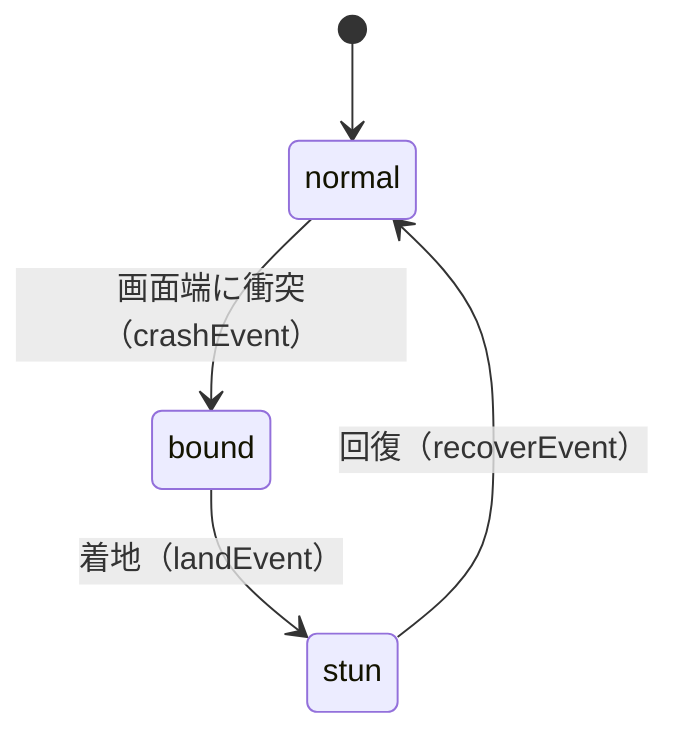

# アーキテクチャ

## レイヤー構成

依存方向は一方向です。上位レイヤーが下位レイヤーに依存し、逆方向の依存はありません。

```
gopher/          エントリポイント（main.go）
    ↓
internal/        ゲーム固有ロジック
    ↓
lib/             汎用フレームワーク（シーン管理・UI）
    ↓
kazura           状態マシン・イベントループ（外部ライブラリ）
ebiten           2Dゲームエンジン
```

| パッケージ | 役割 |
|---|---|
| `gopher` | エントリポイント。フラグ解析 → ウィンドウ設定 → シーン起動 |
| `internal/game` | ゲームシーン本体。状態マシンでTitle〜Resultを管理 |
| `internal/game/gopher` | キャラクターの移動・バウンド物理 |
| `internal/game/pregame` | カウントダウンオーバーレイ |
| `internal/game/audio` | 音階再生（サイン波合成） |
| `internal/game/effect` | テキストエフェクト（panic/recover） |
| `internal/game/proverbs` | Go Proverbs（リザルト画面） |
| `internal/game/ui` | ゲーム固有UIパーツ |
| `internal/credits` | クレジットシーン |
| `internal/screen` | 画面サイズ定数 |
| `lib/scene` | シーンフレームワーク（`ebiten.Game` 実装、スタック管理） |
| `lib/ui` | UIライブラリ（Drawer、ボタン、テキスト描画） |

## シーンフレームワーク

### Scene インターフェース

`lib/scene.Scene` は `ebiten.Game` と同じシグネチャです。各画面（ゲーム、クレジット）がこれを実装します。

```go
type Scene interface {
    Update() error
    Draw(screen *ebiten.Image)
    Layout(outsideWidth, outsideHeight int) (int, int)
}
```

### Manager

`scene.Manager` が `ebiten.Game` を実装し、`ebiten.RunGame()` に渡されます。

- **SetScene** — シーンを差し替え（スタッククリア）
- **PushScene** — 現在のシーンをスタックに積み、新しいシーンに切り替え
- **PopScene** — スタックから前のシーンを復元

クレジット画面は `PushScene` でゲームの上にオーバーレイし、閉じると `PopScene` でゲームに戻ります。

### フレームループ

Manager の `Update()` は毎フレーム以下を実行します。

```
1. now += delta（1/60秒）
2. dispatcher.FastForward(now)  ← 時刻に達したタスクを実行
3. current.Update()             ← 現在のシーンに委譲
```

## 状態マシン

ゲームの振る舞いは [kazura/state](https://github.com/raiich/kazura) の状態マシンで管理されます。

### 構造

```go
// 状態グラフの定義（遷移テーブル）
var stateGraph = state.NewGraph[sceneState](
    titleState{},  // 初期状態
    on[startPregameEvent](titleState{}, pregameState{}),
    on[gameStartEvent](pregameState{}, runningState{}),
    ...
)

// マシン生成・起動
machine := state.NewMachine[sceneState, *sceneData](stateGraph, data)
machine.Launch()
```

### 状態インターフェースのパターン

各状態は以下の4メソッドを持ちます。

| メソッド | タイミング | 用途 |
|---|---|---|
| `Entry` | 状態に入った時 | 初期化、タイマー設定 |
| `handleInput` | `Update()` 内 | ボタン入力の処理 |
| `update` | `Update()` 内 | フレームごとの更新 |
| `draw` | `Draw()` 内 | 状態固有の描画 |

`Entry` は kazura が提供するインターフェース、残り3つはアプリケーション側で定義しています。

### 遷移の発火

```go
// イベントで遷移を発火
machine.Trigger(gameEndEvent{})

// 時間差で遷移（Dispatcherと連携）
machine.AfterFunc(dispatcher, 3*time.Second, func(m *state.AfterFuncMachine[*Data]) {
    m.Trigger(recoverEvent{})
})
```

## ゲームシーンの状態遷移



| 状態 | 振る舞い |
|---|---|
| **Title** | ゲームデータ初期化、Gopher を初期位置に配置 |
| **Pregame** | 「GO」を 300ms 表示し、同時に Running へ遷移 |
| **Running** | メインループ。音階タイマー、ゴール判定、ステージ進行 |
| **Result** | ターミナル風オーバーレイ。テスト結果 + BenchmarkGopher + Go Proverb |

## Gopher キャラクターの状態遷移

Running 中の Gopher は独自の状態マシンを持ちます。



### normal 状態

- `go` タップで `Kick()` → speedX に加算（上限: SpeedMax）
- 60フレームごとに速度が半減し、閾値以下で停止

### bound 状態

- 衝突速度に応じたバウンス（speedX/speedY を計算）
- 進行方向を反転し、重力 0.6 で放物線を描く
- 着地で stun に遷移

### stun 状態

- バウンスの強さに応じた怯み時間（250ms〜700ms）
- `AfterFunc` で自動回復 → `recover` エフェクト表示

## 時間管理

ゲーム内の時間管理は `eventloop.Dispatcher` に統一されています。

```
ebiten 60fps ループ
    ↓
Manager.Update()
    ↓  now += 1/60秒
dispatcher.FastForward(now)
    ↓  登録済みタスクを時刻順に実行
    ├── state.AfterFunc（状態遷移タイマー）
    ├── animation タイマー
    └── pregame カウントダウン
```

Dispatcher を使う理由は、ゲームループのフレームレートと状態遷移のタイミングを同期するためです。`time.AfterFunc` のようなゴルーチンベースのタイマーでは、ゲームループと別スレッドで発火するため競合が起きます。Dispatcher はすべてのタスクを `Update()` 内で同期的に実行します。

## UI ライブラリ

### Drawer インターフェース

`lib/ui` の描画要素は `Drawer` インターフェースで統一されています。

```go
type Drawer interface {
    Rectangle() image.Rectangle
    Draw(screen *ebiten.Image, translate image.Point)
}
```

### 提供要素

| 型 | 用途 |
|---|---|
| `Text` / `TextImage` | テキスト描画。自動センタリング、行間設定 |
| `Rect` / `Circle` / `Line` | プリミティブ図形 |
| `RectButton` / `RoundedRectButton` / `CircleButton` | ボタン（押下状態管理付き） |
| `CompoundDrawer` | 複数 Drawer の合成 |
| `DrawerTranslate` | 座標オフセット付きラッパー |

### 入力フロー

```
ui.Controller.GetButtonState()
    ├── タッチ入力（優先）
    └── マウス入力（タッチがない場合のみ）
         ↓
    (ButtonType, justPressed)
         ↓
    現在の状態の handleInput() に委譲
```
